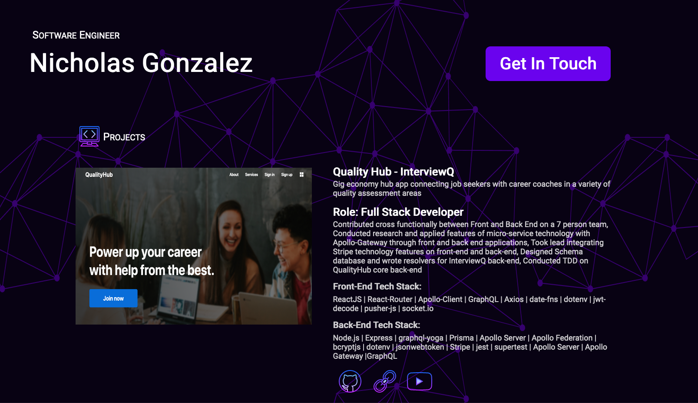

#

# Personal Portfolio 

 

 

## Table of Contents

- [Getting Started](#getting-started)
- [Stack](#stack)
- [Author](#author)  

## Getting Started 

- Fork or directly clone this repository to your local machine
- `cd` into the `portfolio` file directory and use the `yarn` command to install server-side dependencies including:
  - `react`
  - `react-dom`
  - `react-router`
  - `styled-components`
  - `node-sass`
  - `axios`

- Once the dependencies are finished installing, use the `yarn start` command inside the portfolio directory to open the portfolio app in your local browser of choice

## Stack

- [React](https://reactjs.org/)
- [React Router](https://github.com/ReactTraining/react-router)
- [React Conflux](https://github.com/dustinmyers/react-conflux)
- [Styled Components](https://www.styled-components.com/)
- [Axios](https://www.npmjs.com/package/axios)

### Author 

- [Nicholas Gonzalez](https://github.com/NickGonzalez04)