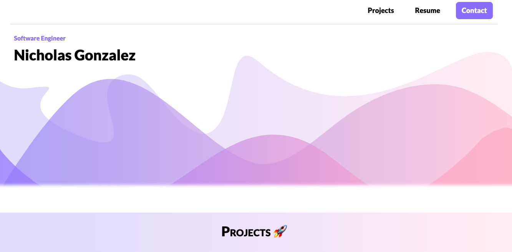

# Personal Portfolio 

## Table of Contents

- [Getting Started](#getting-started)
- [Stack](#stack)
- [Author](#author)  

## Getting Started 

- Fork or directly clone this repository to your local machine
- `cd` into the `portfolio` file directory and use the `yarn` command to install server-side dependencies including:
  - `react`
  - `react-dom`
  - `react-router`
  - `SCSS`
  - `node-sass`
  - `EmailJs`

- Once the dependencies are finished installing, use the `yarn start` command inside the portfolio directory to open the portfolio app in your local browser of choice

## Stack

- [React](https://reactjs.org/)
- [React Router](https://github.com/ReactTraining/react-router)
- [SCSS](https://sass-lang.com/)
- [EmailJs](https://www.emailjs.com)

### Author 

- [Nicholas Gonzalez](https://github.com/NickGonzalez04)
